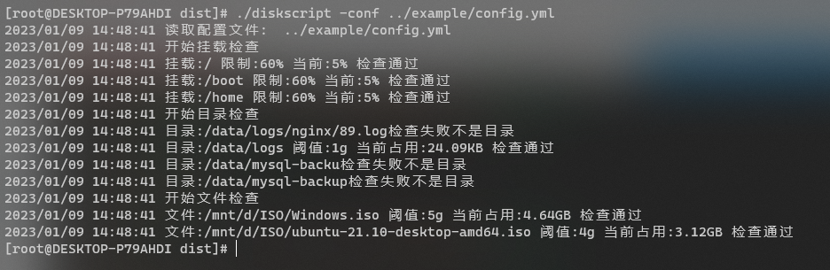
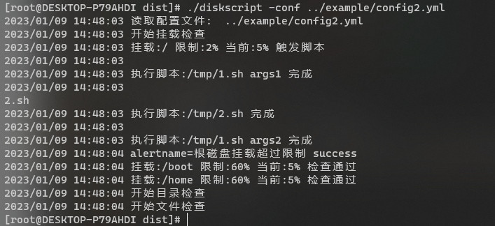

自用的一个服务器磁盘监控工具，根据磁盘占用执行对应的脚本，可以结合alertmanager发送报警。
- 挂载设备百分比监控
- 目录大小监控
- 文件大小监控
- 支持发送到alertmanager报警，自定义labels和报警名称
- 二进制直接使用

> 测试版本，谨慎使用  
> 仅在Centos7下测试通过   
> Windows WSL环境下次磁盘容量获取不正确

`config.yml` 配置文件示例
```yml
console: true  # 是否输出脚本执行信息
alert: # alertmanager 
  enable: true  # 启用报警
  url: "http://localhost:9093"
  labels: ["env=dev","sp=aliyun"] # 全局labels,添加到所有报警中
mount: # 挂载设备
  - mount: "/" # 根分区超过90%占用报警
    threshold: 90  
    alert: true  # 超过阈值报警 
    labels: ["disk=/"]  # 自定义alertmanager labels (可选)
    alertname: "根分区磁盘占用过大"  # 自定义报警名称(可选)
    scripts: # 可选
      - "/bin/sh /data/scripts/xxx.sh"
directory: # 挂载目录
  - directory: "/data/logs/nginx/"
    threshold: 5g # 限制5g 超过5g报警
    alert: true   
    scripts: # 执行脚本
     - "/data/scripts/nginx-log.sh"
  - directory: "/data/logs/xxxxx/"
    threshold: 5g # 限制
    scripts: # 执行脚本
     - "find /data/logs/xxx -mtime +7 -delete"
     - "find /data/logs/xxx -mtime +7 -delete"
file:  # 文件占用检查
  - file: "/mnt/d/ISO/Windows.iso"
    threshold: 5g # 限制
    alert: true
    scripts: # 执行脚本
      - "find /data/logs/xxx -mtime +7 -delete"
      - "find /data/logs/xxx -mtime +7 -delete"
  - file: "/mnt/d/ISO/ubuntu-21.10-desktop-amd64.iso"
    threshold: 4g # 限制
    alert: true
    scripts: # 执行脚本
      - "cat /dev/null > /data/logs/nginx/blog_access.log"
      - "/data/scripts/1.py"
```
可作为定时任务使用
```shell
* * * * * cd /data/xxx && ./diskscript
```

#### 下载使用
```shell
tar xvf diskscript_Linux_x86_64.tar.gz
chmod +x diskscript
# 编辑config.yml文件
# 执行程序
./diskscript 
# 指定配置文件
./diskscript  -conf xxx.yml
```




